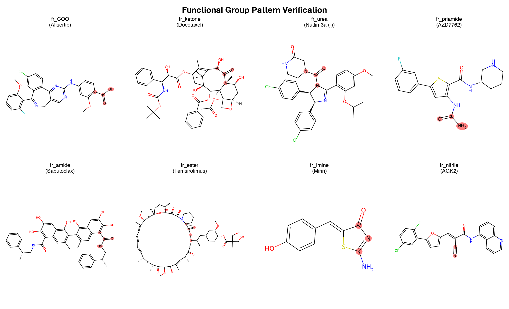
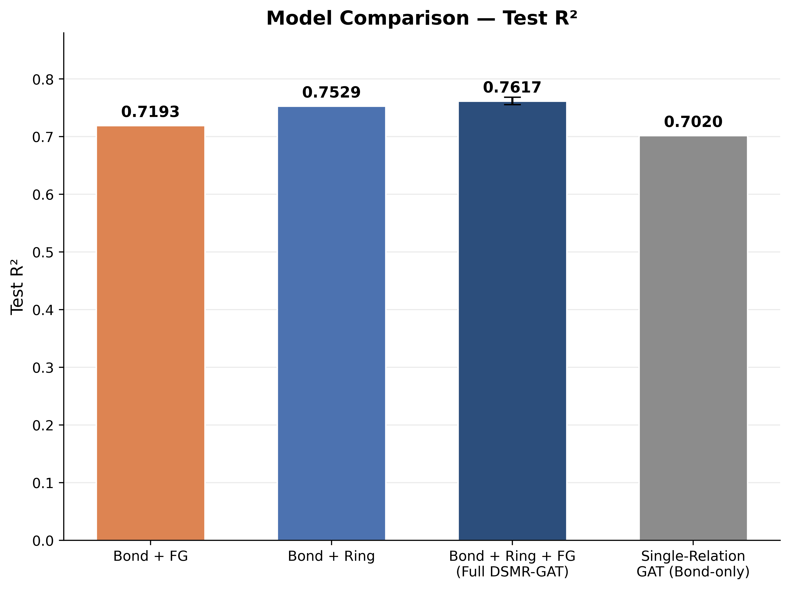
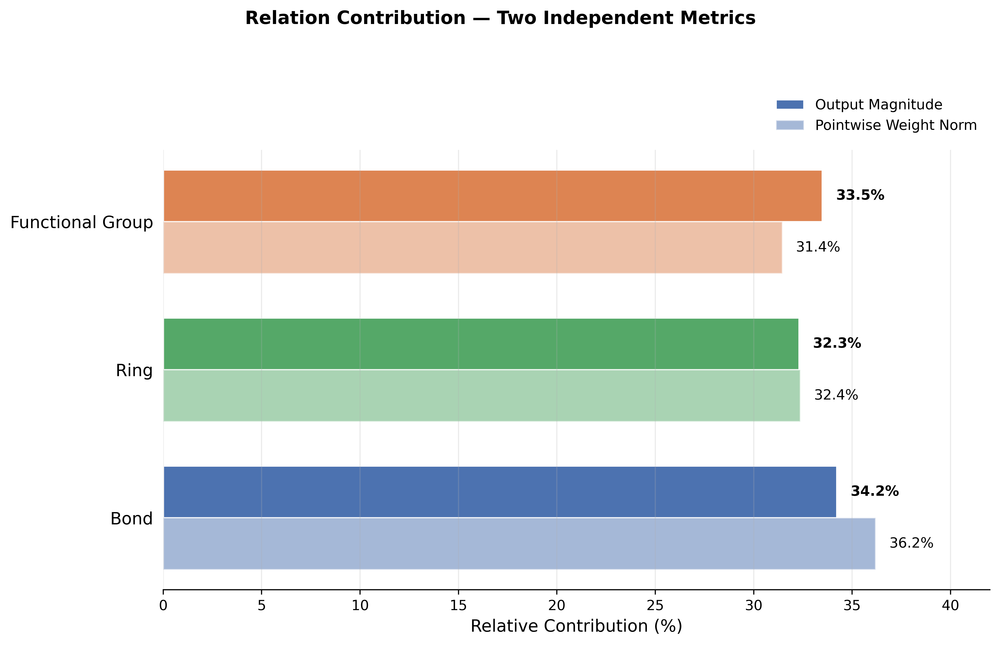
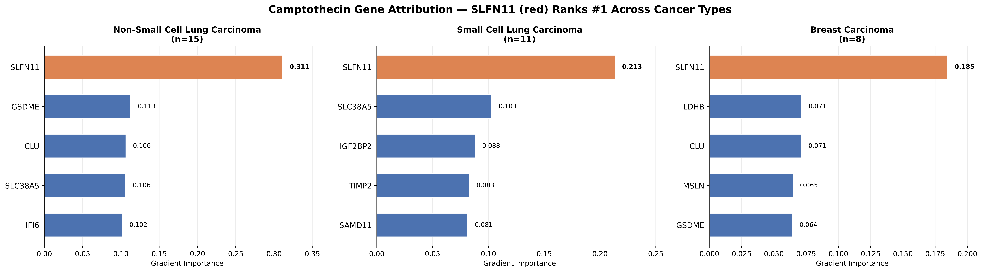
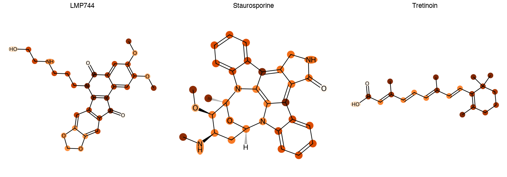
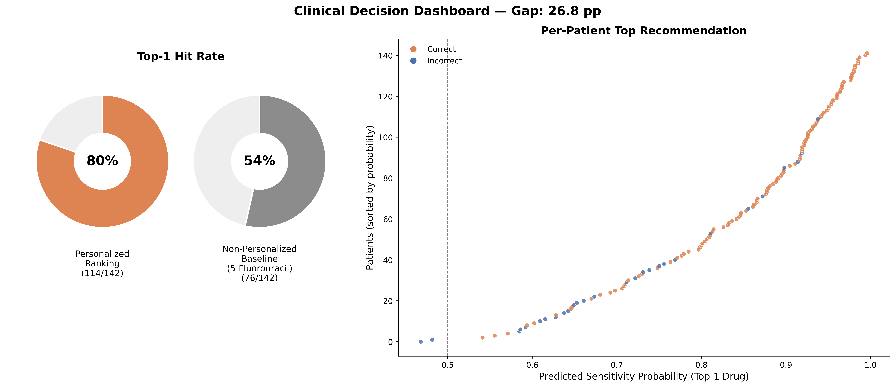

# DeepRelCDR


Depthwise-separable multi-relation graph attention network for interpretable and personalized cancer drug response prediction on **GDSC2**.

<p align="center">
  
</p>
<p align="center"><sub>Real functional-group SMARTS patterns verified directly on known drugs — the exact chemical logic DeepRelCDR uses to build its third molecular relation, alongside covalent bonds and ring membership.</sub></p>

---

## Overview

Almost every graph neural network for drug response prediction represents a molecule the same way: atoms as nodes, covalent bonds as edges, one relation, one adjacency matrix. Two chemically important structural relationships — which atoms share a ring system, and which atoms co-occur in the same functional group — are left for the network to reconstruct indirectly, several message-passing hops deep, instead of being handed to it directly.

DeepRelCDR gives the model all three relations explicitly, and does it without the parameter cost that naive multi-relational graph learning usually pays. Each relation is aggregated by its own lightweight, transform-free attention head operating directly on raw atom features (the *depthwise* stage); a single shared linear layer then mixes across all three relations at once (the *pointwise* stage). The decomposition is a direct structural analogue of depthwise-separable convolution — the same trick MobileNets used to make CNNs cheap — applied to the *relation* dimension of a molecular graph instead of the *channel* dimension of an image.

```text
Drug SMILES → RDKit → Multi-relation graph (Bond + Ring + FG) → DeepRelCDR × 2 → Global mean pool ──┐
                                                                                                     ├─▶ concat → MLP fusion → predicted LN_IC50
Cell-line gene expression (1000-dim) → MLP encoder (2 layers) ────────────────────────────────────┘
```

---

## Why This Is More Than a Baseline R²

- **A parameter-efficient way to add structure, not just a bigger model** — the naive way to add two more relations to a graph triples the per-relation transformation matrix; DeepRelCDR instead keeps the depthwise stage transform-free (2·*C*ᵢₙ parameters per relation) and defers all cross-relation mixing to one shared pointwise layer.
- **The ablation isolates *why* it works, not just *that* it works** — removing the ring relation costs roughly 4.6× more accuracy than removing the functional-group relation, and every one of these gaps is checked against training-run noise (three independent seeds) rather than reported as a single lucky run.
- **Two independent diagnostics agree the model actually uses all three relations** — attention-weighted output magnitude and pointwise fusion weight norm, computed two completely different ways on the trained model, both place bond/ring/functional-group within a narrow 31–36% band, with no relation dominating or collapsing to near-zero.
- **A biological check the model was never trained on** — gradient-based gene attribution recovers **SLFN11**, an independently established biomarker for topoisomerase-inhibitor sensitivity, as the top-ranked gene for camptothecin response across three separate cancer types, with no supervision signal referencing SLFN11 anywhere in training.
- **A decision output checked against ground truth, not just described** — a per-patient personalized drug-ranking dashboard is validated against real held-out response labels, not only reported as a theoretical capability.

---

## Dataset

[GDSC2 — Genomics of Drug Sensitivity in Cancer](https://www.cancerrxgene.org/downloads/bulk_download)

- 235 drugs with resolved molecular structure (SMILES), out of 286 unique drug names screened
- 944 cancer cell lines with matched RNA-seq expression
- 199,903 drug–cell-line response pairs

Cell lines (not response rows) are split 70/15/15 at the cell-line level, and both gene selection and expression normalization are computed strictly from the training split — see [`data/README.md`](data/README.md) for download instructions and the full preprocessing pipeline.

---

## Methodology

**Multi-relation molecular graph** — each drug is parsed by RDKit into three edge sets sharing the same atom nodes: covalent bonds (first-order connectivity), ring co-membership (from RDKit's SSSR, fully connecting every atom pair within a ring), and functional-group co-membership (65 SMARTS patterns, RDKit's built-in `Fragments` library after excluding patterns that overlap with the ring relation, plus one custom boronic-acid pattern).

**Depthwise-separable relation-wise attention** — for each relation, a single learnable scoring vector computes attention logits directly on raw, untransformed atom features (no per-relation weight matrix), normalized by softmax and passed through dropout before aggregation. The three relation-specific outputs are concatenated and passed through one shared pointwise linear layer, followed by batch normalization and LeakyReLU. Two such layers are stacked, followed by global mean pooling into a 128-dim drug embedding.

**Cell-line encoder** — the 1,000 most variable genes (training-set only) are passed through a two-layer MLP into a 128-dim cell-line embedding.

**Fusion** — the drug and cell-line embeddings are concatenated and passed through a fusion layer to predict `LN_IC50`.

**Training** — Adam, lr=1e-3, weight decay=1e-5, batch size 32, up to 20 epochs with early stopping (patience=5).

**Relation-level ablation** — the full three-relation model is compared against Bond+Ring, Bond+FG, and a single-relation (bond-only) attention baseline, each retrained under identical conditions.

**Robustness** — every configuration in the ablation is retrained with three independent random seeds; gaps between configurations are checked against the resulting seed-to-seed standard error, not just reported as point estimates.

**Explainability** — gradient-based attribution on the input gene-expression vector (gene-level) and on the ring-relation attention branch (atom-level), plus two independent relation-contribution diagnostics computed directly on the trained model.

Full hyperparameters: [`configs/config.py`](configs/config.py).

---

## Results

### Model Performance

| Metric | Value |
|:---|:---|
| Full DeepRelCDR (Bond+Ring+FG), Test R² | **0.7617** |
| 95% bootstrap CI (1,000 resamples) | [0.7555, 0.7686] |
| Full model, mean ± SD across 3 seeds | 0.7619 ± 0.0030 |
| Bond + Ring (FG removed) | 0.7529 |
| Bond + Functional Group (Ring removed) | 0.7193 |
| Single-relation GAT (bond-only baseline) | 0.7020 |

<p align="center">
  
</p>
<p align="center"><sub>Test R² across all four configurations, with the 95% bootstrap CI on the full model.</sub></p>

Removing the ring relation costs roughly **4.6× more accuracy** than removing the functional-group relation (Δ = −0.0424 vs. Δ = −0.0088). Both gaps — and every other pairwise gap between configurations — exceed the per-configuration seed-to-seed standard error by more than 3.8×, so none of this is explainable by training-run noise alone. Full breakdown: [`assets/results/ablation/`](assets/results/ablation/).

### Relation Contribution Diagnostics

Two metrics computed directly on the trained model, independent of the ablation study above: mean attention-weighted output magnitude and the ℓ2 norm of each relation's block in the pointwise fusion matrix.

| Metric | Bond | Ring | Functional Group |
|:---|:---:|:---:|:---:|
| Output magnitude | 34.2% | 32.3% | 33.5% |
| Pointwise fusion weight norm | 36.2% | 32.4% | 31.4% |

<p align="center">
  
</p>
<p align="center"><sub>Both diagnostics place all three relations within a narrow 31–36% band — no relation dominates or collapses to near-zero contribution.</sub></p>

### Biological Validation: SLFN11

Gradient-based attribution for camptothecin (a topoisomerase I inhibitor) ranks **SLFN11** first by a wide margin across three independent cancer types — 2.1–2.8× the attribution score of the second-ranked gene in every case — consistent with its independently established role as a chemosensitivity biomarker in the pharmacogenomics literature.

| Cancer type (n) | Top gene | Score | 2nd-ranked gene | Score |
|:---|:---|:---:|:---|:---:|
| NSCLC (15) | **SLFN11** | 0.311 | GSDME | 0.113 |
| SCLC (11) | **SLFN11** | 0.213 | SLC38A5 | 0.103 |
| Breast carcinoma (8) | **SLFN11** | 0.185 | LDHB | 0.071 |

<p align="center">
  
</p>
<p align="center"><sub>SLFN11 was never a training target — this is gradient attribution on a model trained only to predict LN_IC50.</sub></p>

<p align="center">
  
</p>
<p align="center"><sub>Per-atom output magnitude of the ring-relation attention branch, overlaid directly on real drug structures — darker atoms are weighted more heavily when the ring relation builds that drug's embedding.</sub></p>

### Error Analysis

Mean absolute error on the full test set, broken down by cancer type and drug, is reported to characterize where predictions are least reliable rather than to argue for or against any architectural choice. Full breakdown: [`assets/results/error_analysis/`](assets/results/error_analysis/).

### Clinical Decision Dashboard

| Metric | Value |
|:---|:---|
| Non-personalized baseline (top-1 hit rate) | 53.5% (76/142) |
| Personalized ranking, this model (top-1 hit rate) | **80.3%** (114/142) |
| Gap | 26.8 percentage points |

For each of the 142 test-set cell lines screened against at least two drugs, the drug with the highest model-predicted sensitivity is compared against a fixed non-personalized baseline (the single drug with the best average sensitivity on the training split). A recommendation counts as a hit if the cell line's true measured response falls below that drug's training-set median threshold.

<p align="center">
  
</p>
<p align="center"><sub>Personalized vs. non-personalized top-1 drug recommendation, validated against real measured response.</sub></p>

---

## Project Structure

```text
DeepRel-CDR/
├── assets/results/     ablation, relation diagnostics, explainability, dashboard, error analysis, molecular graph figures
├── configs/             hyperparameters and paths
├── data/                 preprocessing, SMILES resolution, multi-relation graph construction, dataset class
├── models/               DeepRelCDR architecture, ablation variants, checkpoints
├── src/                   training, evaluation, metrics, relation diagnostics, explainability, dashboard, visualization
├── main.py                end-to-end pipeline entry point
└── requirements.txt
```

---

## Quickstart

```bash
git clone https://github.com/SarvinChitsaz/DeepRel-CDR.git
cd DeepRel-CDR
pip install -r requirements.txt
```

Download and place the GDSC2 files as described in [`data/README.md`](data/README.md), then:

```bash
python main.py
```

Pretrained checkpoints are not included in this repository due to file size; see [`models/checkpoints/README.md`](models/checkpoints/README.md).

**Requirements:** `torch>=2.0`, `torch_geometric`, `rdkit`, `pandas`, `numpy`, `scikit-learn`, `scipy`, `matplotlib`, `networkx`, `pubchempy`.

---

## Limitations

- Research/prototype implementation — not intended for clinical diagnosis.
- Evaluated on cultured cell lines (GDSC2), not patient outcomes.
- The three relations (bond, ring, functional group) were chosen a priori from chemical domain knowledge, not learned or selected from a larger candidate set.
- Training-run variance is quantified (3 seeds), but variance due to the choice of cell-line split itself is not — a k-fold protocol would additionally address this.
- No quantitative head-to-head comparison against prior bond-only GNN baselines (e.g., GraphDRP, DeepCDR) under a shared evaluation protocol; the ablation instead isolates the proposed design against an internal single-relation baseline trained under identical conditions.
- The clinical dashboard uses a simplified median-split sensitivity threshold as a proxy for clinical benefit, not patient outcome data.
- Evaluated on a single pharmacogenomic resource (GDSC2); generalization to other screens (CCLE, CTRP) is untested.

---

## Future Work

- Learning or expanding the relation set beyond the three used here
- A quantitative benchmark against published GNN-based drug response models under a shared evaluation protocol
- k-fold cross-validation over cell-line splits, to quantify split-choice variance alongside the training-run variance already reported
- Evaluating generalization across additional pharmacogenomic datasets

---

## License

MIT — see [LICENSE](LICENSE).
